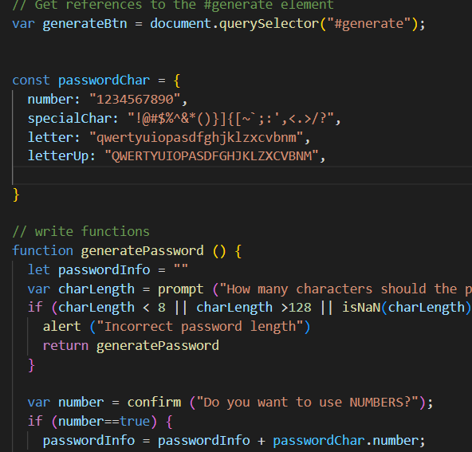
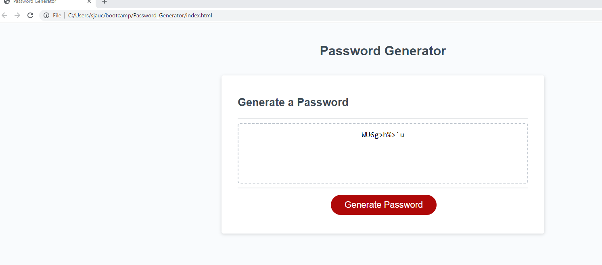

# Password_Generator

This password generator was created so that the *user* can have a random **password** created for them when they click the "generate password" button.  The **password** will contain a combination of:

*upper case letters  
*lower case letters  
*numbers  
*special characters  

After clicking "generate password, the *user* will select how long the **password** should be (at least 8 characters, but no more than 128).  The *user* will then confirm that the password will include:

1. Upper case letters  
2. Lower case letters  
3. Numbers  
4. Special Characters  

The **password** will then generate using the criteria provided.  

Here is an example of some code in the project:   

***  

Here is the ***Password Generator*** working  

  

Here is the deployed ***Password Generator***  

https://skjauch.github.io/Password_Generator/ 

Here is the link to the GitHub Repository  

https://github.com/SKJauch/Password_Generator